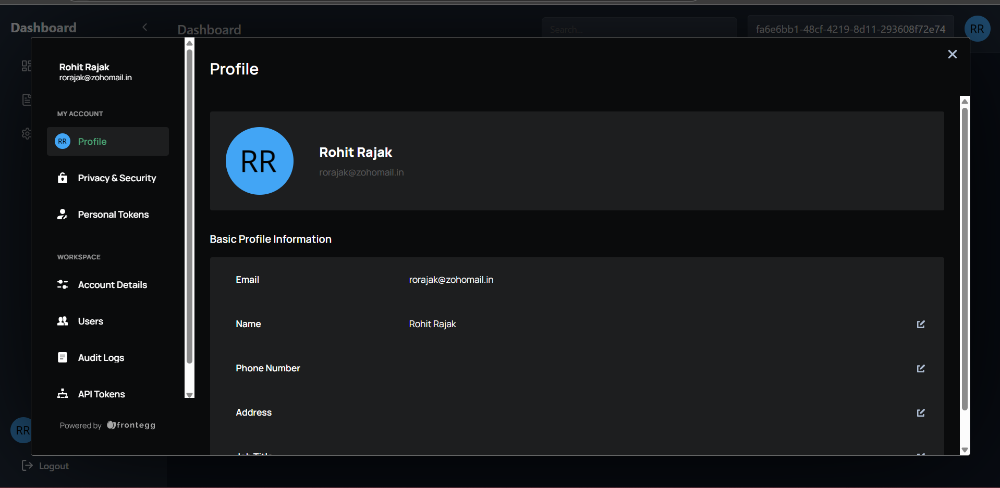

# Frontegg Authentication Model

## Overview

**Tenant-Switching Dashboard** is a React-based application that leverages [Frontegg](https://frontegg.com/) for authentication and user management. The application features a responsive dashboard with a collapsible sidebar, user avatar, search functionality, and the ability for users to switch between multiple tenants seamlessly.




[watch the video ](https://vimeo.com/1014076636)

## Features

- **User Authentication:** Secure login and logout using Frontegg.

- **User Profile:** Display user information with avatar and email.

- **Tenant Switching:** Dropdown to switch between multiple tenants.
- **Admin Portal Access:** Quick access to Frontegg's Admin Portal.
- **TypeScript Integration:** Enhanced type safety and developer experience.
- **Tailwind CSS Styling:** Modern and responsive UI design.
- **Lucide Icons:** Consistent and visually appealing icons.

## Technologies Used

- **React:** Frontend library for building user interfaces.
- **TypeScript:** Superset of JavaScript for type safety.
- **Frontegg:** Authentication and user management platform.
- **Tailwind CSS:** Utility-first CSS framework for styling.
- **Lucide Icons:** Open-source icon library.
- **Next.js (Optional):** If integrated, for server-side rendering and routing.

## Prerequisites

Before you begin, ensure you have met the following requirements:

- **Node.js:** Install [Node.js](https://nodejs.org/) (v14 or later).
- **npm or Yarn:** Package manager installed with Node.js.
- **Frontegg Account:** Set up an account with [Frontegg](https://frontegg.com/) and configure your application.

## Installation

1. **Clone the Repository:**

   ```bash
   git clone https://github.com/your-username/tenant-switching-dashboard.git
   cd tenant-switching-dashboard
   ```

2. **Install Dependencies:**

   Using npm:

   ```bash
   npm install
   ```

   Or using Yarn:

   ```bash
   yarn install
   ```

3. **Configure Environment Variables:**

   Create a `.env` file in the root directory and add your Frontegg configuration:

   ```env
   VITE_BASE_URL=<your-frontegg-subdomain>
   VITE_CLIENT_ID=<your-frontegg-client-id>
   VITE_APP_ID=<your-frontegg-app-id>
   ```

   Replace `your-frontegg-client-id` and `your-frontegg-subdomain` with your actual Frontegg credentials.

## Running the Application

Start the development server:

Using npm:

```bash
npm run dev
```

Or using Yarn:

```bash
yarn dev
```

Open [http://localhost:5173](http://localhost:5173) in your browser to view the application.

## Usage

### Tenant Switching

The application allows users to switch between multiple tenants they belong to. Here's how to use the tenant switching feature:

1. **Login:**
   
   - Navigate to the login page and authenticate using your credentials.
   - Upon successful login, you will be redirected to the dashboard.

2. **Accessing the Tenant Dropdown:**

   - In the dashboard header, you will see a dropdown labeled "Select a tenant" if you belong to multiple tenants.

3. **Switching Tenants:**

   - Click on the dropdown to view all available tenants.
   - Select the desired tenant from the list.
   - The application will update the active tenant state, and you may be redirected or see tenant-specific data based on your implementation.

4. **Logout:**

   - Click the "Logout" button in the sidebar to end your session.


## Acknowledgments

- [Frontegg](https://frontegg.com/) for providing robust authentication solutions.
- [Tailwind CSS](https://tailwindcss.com/) for utility-first styling.
- [Lucide Icons](https://lucide.dev/) for beautiful and customizable icons.
- [React](https://reactjs.org/) community for continuous support and resources.

